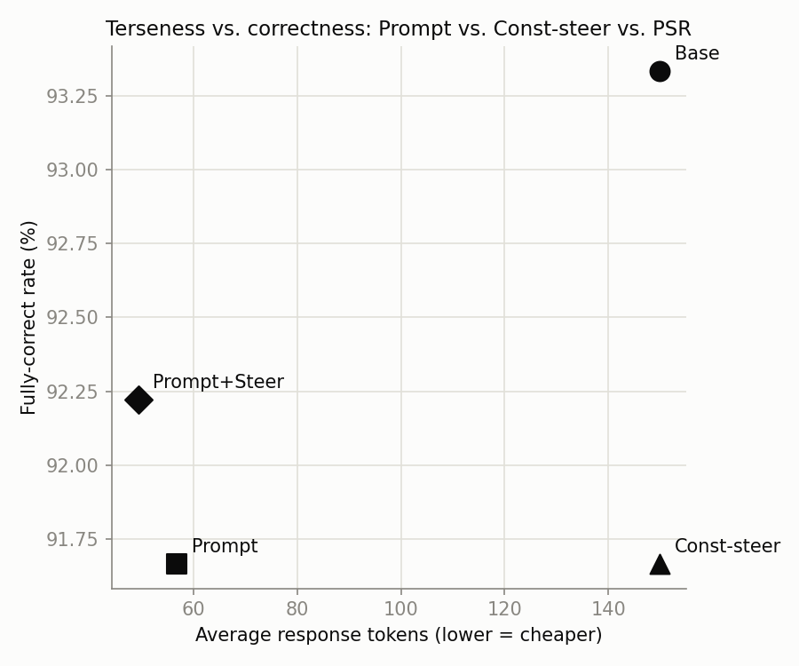
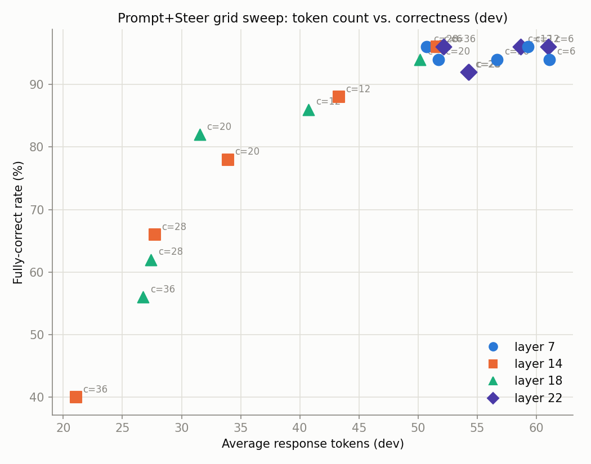

# Does activation steering help on top of an already-terse prompt?

Tests whether constant activation steering (Stolfo et al., arXiv 2410.12877 — a diff-in-means
vector added at inference) can push `Qwen2.5-Coder-7B-Instruct`'s code explanations *shorter than
prompting alone already gets them*, rather than treating steering as a standalone replacement for
prompting. Four conditions per test example:

1. **Base** — neutral prompt, no instruction, no steering.
2. **Prompt** — caveman's actual "full" mode instruction, word for word from
   [caveman](https://github.com/juliusbrussee/caveman)'s `skills/caveman/SKILL.md` (opening line,
   Persistence, Rules, no-self-reference paragraph, Pattern line — see `model_common.CAVEMAN_SUFFIX`).
   Auto-Clarity, Boundaries, and the language-preservation paragraph are dropped: none of those
   scenarios (destructive ops, writing commits/PRs, non-English input) exist in this task.
3. **Const-steer** — the diff-in-means vector added at inference, Base prompt (no instruction text).
4. **Prompt+Steer** — the same vector added at inference, *on top of* the Prompt condition — this
   is the primary comparison: does steering add anything once the instruction is already present?

Data: CodeXGLUE code-to-text (Python), docstrings stripped from the code via AST before use as
reference explanations, to avoid leaking the answer into the prompt (`src/data_prep.py`).

## Result

Test set (180 held-out examples), judged by `gpt-4o-mini` for correctness against the original
docstring, blinded to condition. Correctness is reported as a rounded band, not false-precision
decimals — see [Statistical details](#statistical-details) for why and for the exact counts:

| Condition | Avg tokens | Fully correct |
|---|---|---|
| Base | 150.0 (censored — see below) | 90-95% |
| Prompt | 56.8 | 90-95% |
| Const-steer alone | 149.9 | 90-95% |
| **Prompt+Steer** | **49.3** | **90-95%** |

**Steering on top of the prompt gets a further ~13% token reduction beyond prompting alone, with no
statistically detectable correctness cost.** Const-steer alone is a non-result at this coefficient
(149.9 tokens, indistinguishable from Base) — the coefficient was calibrated specifically for the
combined regime, not as a standalone replacement for the instruction; this matches the general
pattern (also seen at higher coefficients during calibration) that steering alone is substantially
weaker than prompting.

Base's 150.0 average is right-censored: 95.6% of Base responses hit `MAX_NEW_TOKENS` without the
model choosing to stop, so it's a floor on "at least this many tokens," not a real measurement of
default verbosity — the Prompt vs. Prompt+Steer comparison (both close to fully natural stopping)
is the one to trust.



## Examples

Real test-set pairs, Prompt vs. Prompt+Steer, both judged fully correct (`correct=2`) — steering
compresses without dropping the substance:

<details open>
<summary><code>_map_smtp_headers_to_api_parameters</code> — 131 → 26 tokens</summary>

```python
def _map_smtp_headers_to_api_parameters(self, email_message):
    api_data = []
    for (smtp_key, api_transformer) in six.iteritems(self._headers_map):
        data_to_transform = email_message.extra_headers.pop(smtp_key, None)
        if data_to_transform is not None:
            if isinstance(data_to_transform, (list, tuple)):
                for data in data_to_transform:
                    api_data.append((api_transformer[0], api_transformer[1](data)))
            elif isinstance(data_to_transform, dict):
                for data in six.iteritems(data_to_transform):
                    api_data.append(api_transformer(data))
            else:
                api_data.append((api_transformer[0], api_transformer[1](data_to_transform)))
    return api_data
```

- **Prompt (131 tok):** "Function `_map_smtp_headers_to_api_parameters` takes an `email_message` object and maps its SMTP headers to API parameters. It iterates over a predefined mapping (`_headers_map`) where each key is an SMTP header and the value is a tuple containing an API parameter name and a transformation function. The function extracts the corresponding header values from `email_message.extra_headers`, applies any necessary transformations, and appends the transformed data to `api_data`. If the header value is a list or tuple, it processes each item individually. If it's a dictionary, it processes each key-value pair. Finally, it returns the list of transformed API parameters."
- **Prompt+Steer (26 tok):** "Email headers map to API params. Iterate over header map. Extract header data. Transform and append to list. Return transformed data."
</details>

<details>
<summary><code>other_punctuation</code> — 91 → 29 tokens</summary>

```python
def other_punctuation():
    punc = ''.join(set(symbols.ALL_PUNC) - set(symbols.TONE_MARKS) - set(symbols.PERIOD_COMMA) - set(symbols.COLON))
    return RegexBuilder(pattern_args=punc, pattern_func=lambda x: u'{}'.format(x)).regex
```

- **Prompt (91 tok):** "The function `other_punctuation()` generates a regular expression that matches any punctuation character except tone marks, periods and commas, and colons. It first creates a string of all punctuation characters using `symbols.ALL_PUNC`. Then it removes tone marks, periods and commas, and colons from this string. Finally, it uses `RegexBuilder` to create a regex pattern that matches any character in the resulting string. The regex is returned by the function."
- **Prompt+Steer (29 tok):** "This function creates a regex pattern that matches any punctuation symbol except tone marks, periods and commas, and colons. It then returns this pattern."
</details>

<details>
<summary><code>get_subject_guide_for_canvas_course_sis_id</code> — 82 → 24 tokens</summary>

```python
def get_subject_guide_for_canvas_course_sis_id(course_sis_id):
    (year, quarter, curriculum_abbr, course_number, section_id) = course_sis_id.split('-', 4)
    return get_subject_guide_for_section_params(year, quarter, curriculum_abbr, course_number, section_id)
```

- **Prompt (82 tok):** "Function `get_subject_guide_for_canvas_course_sis_id` takes a string `course_sis_id`. It splits this string into five parts using hyphen `-` as delimiter, up to four times. The parts are year, quarter, curriculum abbreviation, course number, and section ID. Then it calls another function `get_subject_guide_for_section_params` with these five parts as arguments and returns its result."
- **Prompt+Steer (24 tok):** "Function splits `course_sis_id` into parts. Calls another function with those parts. Returns result of that call."
</details>

<details>
<summary><code>initial_step</code> (CORDIC algorithm) — 86 → 29 tokens</summary>

```python
def initial_step(self, phase, x, y):
    self.x[0] = x
    self.y[0] = y
    self.phase[0] = phase
    if self.MODE == CordicMode.ROTATION:
        if phase > 0.5:
            self.x[0] = -x
            self.phase[0] = phase - 1.0
        elif phase < -0.5:
            self.x[0] = -x
            self.phase[0] = phase + 1.0
    elif self.MODE == CordicMode.VECTORING:
        if x < 0.0 and y > 0.0:
            self.x[0] = -x
            self.y[0] = -y
            self.phase[0] = 1.0
        elif x < 0.0 and y < 0.0:
            self.x[0] = -x
            self.y[0] = -y
            self.phase[0] = -1.0
```

- **Prompt (86 tok):** "Function `initial_step` sets initial values for coordinates `x`, `y`, and phase. Depending on `MODE`, it adjusts these values based on specific conditions. If in rotation mode, it flips `x` and adjusts phase if outside [-0.5, 0.5]. In vectoring mode, it flips both `x` and `y` and sets phase to 1 or -1 based on quadrant."
- **Prompt+Steer (29 tok):** "Set initial values for `x`, `y`, and `phase`. Adjust based on `MODE` and input values. Continue with next step."
</details>

<details>
<summary><code>check_validation_level</code> — 70 → 22 tokens</summary>

```python
def check_validation_level(validation_level):
    if validation_level not in (VALIDATION_LEVEL.QUIET, VALIDATION_LEVEL.STRICT, VALIDATION_LEVEL.TOLERANT):
        raise UnknownValidationLevel
```

- **Prompt (70 tok):** "Function `check_validation_level` checks if input `validation_level` is one of predefined constants `VALIDATION_LEVEL.QUIET`, `VALIDATION_LEVEL.STRICT`, or `VALIDATION_LEVEL.TOLERANT`. If not, it raises an exception `UnknownValidationLevel`.\n\nIf valid, proceed with next steps. If invalid, halt and report error."
- **Prompt+Steer (22 tok):** "Function checks if `validation_level` is one of predefined levels. If not, raises `UnknownValidationLevel`."
</details>

### Finding the operating point mattered

The first calibration pass picked its config by sweeping (layer, coefficient) on dev and choosing
whichever was most aggressive (lowest tokens) without producing obviously degenerate/repetitive
output — no correctness signal in that loop. That picked layer 14, coeff 36, which looked fine by
the degenerate check but collapsed dev full-correct rate to ~40% (e.g. `_descriptor_names`'s Django
descriptor-filtering detail dropped entirely: "List self's descriptors."). Judging the *entire*
grid (`src/sweep_dev.py` + `src/judge_sweep.py` + `src/analyze_sweep.py`, 20 configs × 50 dev
examples) showed why: correctness holds around 90-95%+ for coefficients 6-12 at layers 14/18, then
falls off a cliff past ~20, down into the 40-65% range. Layer 14, coeff 6 was picked from that curve
instead of trusting the degenerate-only auto-pick — see below for how much that specific pick should,
and shouldn't, be trusted.



## Statistical details

**Is the Prompt+Steer test-set result just cherry-picking?** Two separate risks, checked
separately:

**1. Is "Prompt+Steer ≥ Prompt" on the test set real, or noise?** Test set, n=180, McNemar's exact
test on paired fully-correct outcomes (same 180 examples, both conditions): Prompt 165/180,
Prompt+Steer 166/180 — 4 examples correct only under Prompt, 5 correct only under Prompt+Steer,
**p = 1.0**. That's as close to a coin flip as paired data gets. Read this as: **steering shows no
detectable correctness cost**, not as "steering improves correctness" — the one-example difference
carries no statistical weight either way. What *is* well-supported and doesn't need a significance
test: the ~13% token reduction, since it's a large, consistent shift across the distribution, not a
one-example-sized effect.

**2. Was picking layer 14/coeff 6 out of 20 dev configs cherry-picking?** Partly, yes — and it's
worth being explicit about where. Wilson 95% CIs on the dev full-correct rate (n=50 per config):

| Layer | Coeff | k/50 | Rate | 95% CI |
|---|---|---|---|---|
| 7 | 12 | 48 | 96% | [86.5%, 98.9%] |
| 7 | 28 | 48 | 96% | [86.5%, 98.9%] |
| **14** | **6** | **48** | **96%** | **[86.5%, 98.9%]** |
| 22 | 6 | 48 | 96% | [86.5%, 98.9%] |
| 22 | 12 | 48 | 96% | [86.5%, 98.9%] |
| 22 | 36 | 48 | 96% | [86.5%, 98.9%] |
| 14 | 12 | 44 | 88% | [76.2%, 94.4%] |
| 18 | 20 | 41 | 82% | [69.2%, 90.2%] |
| 14 | 36 | 20 | 40% | [27.6%, 53.8%] |

*(full 20-row table: `results/summary_sweep_dev.json`)*

Six different configs tie at exactly 48/50, and the CI on any single one of them comfortably
overlaps configs as low as 88% or even 82%. With only 50 dev examples per config and 20 configs
swept, picking "the max observed value" has real winner's-curse risk — the specific rank-1 pick
among that top cluster shouldn't be over-trusted, which is why the result above is reported as a
90-95% band rather than "96%." What *is* robust: the top cluster (78-96%, overlapping CIs) and the
collapsed bottom cluster (40-66% at coeff ≥28, layers 14/18) have **non-overlapping** CIs — the
qualitative finding "moderate coefficients are safe, aggressive ones collapse correctness" doesn't
depend on which exact config within the safe cluster you'd pick.

## Scope decisions

- PSR (arXiv 2605.03907) is paused for now — `src/steering_psr.py` still exists but isn't run.
  An earlier pass showed the MSE-matching variant underperforming constant steering; revisit later.
- The judge is `gpt-4o-mini` (OpenAI), not Claude — switched to use available OpenAI credits. Reads
  the key from `openai.key` (gitignored, never commit it).
- Task is code **explanation** only, not code generation.

## Running it

Everything in `src/data_prep.py`, `src/judge*.py`, and `src/analyze*.py` runs locally — no GPU
needed. The GPU-bound steps (`steering_const.py`, `sweep_dev.py`, `generate.py`) run on a rented
GPU pod via `infra/run_gpu_pipeline.sh` (or invoked directly, as when re-running just one step).

```
python3 src/data_prep.py                        # local — data/{train,dev,test}.jsonl

# on the GPU pod:
bash infra/setup_runpod.sh
python3 src/steering_const.py                   # -> results/const_steer_{config.json,directions.pt}
python3 src/sweep_dev.py                        # -> results/sweep_dev.jsonl (all grid configs, dev)

# back locally: judge the sweep, inspect the frontier, edit const_steer_config.json's
# layer/coeff to the chosen operating point (see "Finding the operating point mattered" above)
python3 src/judge_sweep.py                      # -> results/judged_sweep_dev.jsonl (needs openai.key)
python3 src/analyze_sweep.py                    # -> results/summary_sweep_dev.json, plot

# back on the GPU pod, with the final chosen config:
python3 src/generate.py --split test            # -> results/generations_test.jsonl

# back locally:
python3 src/judge.py --split test               # -> results/judged_test.jsonl (needs openai.key)
python3 src/analyze.py --split test             # -> results/summary_test.json, summary_plot_test.png
```
