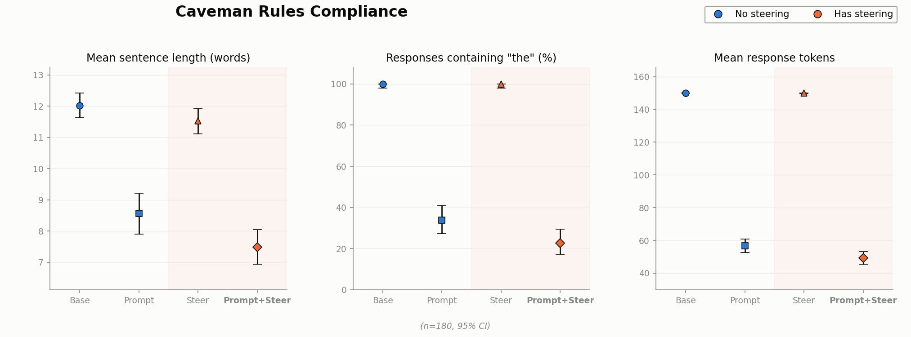

# Activation Steering for Caveman-style Prompts

The [caveman](https://github.com/juliusbrussee/caveman) package has become very popular. Many engineers want their coding agent to drop the filler and answer concisely. Its motto is short and to the point: *"why use many token when few token do trick"*? 

By prompting the model to trim definite articles and favor fragment-style answers, the package cuts roughly 65% of output tokens while keeping code and technical content intact. 

Here, we ask whether activation steering can push the correctness and conciseness of these outputs even further. Our setup follows the line of work on activation steering for instruction following studied by Stolfo et al. [1], among others, applied to a practical use case: the `caveman` skill for agent-based development.

The model we test is `Qwen2.5-Coder-7B-Instruct`, and the thing we are trying to compress is its natural-language explanations of code. Prompting alone can already shorten these explanations; the real question is whether steering adds anything *on top of* prompting, and whether it can do so without degrading the explanation itself. Overall, our results support Prompt+Steer outperforming the Prompt method alone.




We test four methods:

**1. Base** — A neutral prompt: no conciseness instruction, no steering. This is our reference point for what the model does when left to its own devices.

**2. Prompt** — The caveman "full" mode instruction, reproduced word for word from [caveman](https://github.com/juliusbrussee/caveman)'s `skills/caveman/SKILL.md`. We keep the opening line, the Persistence section, the Rules, the no-self-reference paragraph, and the Pattern line (assembled in `model_common.CAVEMAN_SUFFIX`).

**3. Steer** — The diff-in-means steering vector, added at inference time on top of the **Base** prompt. There is no conciseness instruction in the prompt, so the only pressure toward brevity comes from the steering vector itself; this isolates what steering does on its own. The vector is computed by difference-in-means, as in Arditi et al. [3]: the mean residual-stream activation over a set of concise ("caveman") generations minus the mean over ordinary verbose ones, taken at a chosen layer. [^1]

[^1]: This is a deliberately simple construction, but it has a long lineage in the interpretability literature — activation addition (Turner et al. [4]), representation engineering (Zou et al. [5]), inference-time intervention (Li et al. [6]), contrastive activation addition (Rimsky et al. [7]), and mass-mean probing (Marks & Tegmark [8]) all build steering or probing directions from contrasts between activations. While the resulting vector is model- and prompt-specific, extracting one is cheap and well-tooled: libraries such as [`repeng`](https://github.com/vgel/repeng) and [`steering-vectors`](https://github.com/steering-vectors/steering-vectors) can reduce it to a few lines.

**4. Prompt+Steer** — The same steering vector, added at inference time, but layered *on top of* the **Prompt** condition. This is our primary comparison, and it targets the central question directly.

### Results

| Condition | Avg tokens | Fully correct |
|---|---|---|
| Base | 150.0 (censored — see below) | 90-95% |
| Prompt | 56.8 | 90-95% |
| Steer alone | 149.9 | 90-95% |
| **Prompt+Steer** | **49.3** | 90-95% |

**Steering on top of the prompt gets a further ~13% token reduction beyond prompting alone.**  Constant steering alone results in 149.9 tokens, which makes it indistinguishable from Base; the coefficient was calibrated specifically for the combined regime, not as a standalone replacement for the instruction. This matches a pattern we observed at higher coefficients during calibration: difference-of-means steering alone is substantially weaker than prompting.

We set the max token count to 150 for cost and performance reasons. Accordingly, the average token count reported for Base is lower than it would be in a natural setting -- 95% of Base responses hit `MAX_NEW_TOKENS` without the model choosing to stop. The most informative comparison is Prompt vs. Prompt+Steer, since both are close to fully natural stopping.


## The Task and Data

All experiments run on the **CodeXGLUE code-to-text** task, where the model is asked to
explain a function in natural language.

One important preprocessing step: before any code is used as a reference, we strip its
docstrings out via AST parsing (`src/data_prep.py`). This prevents answer leakage — without
it, the reference explanation could bleed into the prompt body and quietly inflate the
model's apparent accuracy. Stripping the docstrings keeps the evaluation honest.

We split the corpus into 180 train, 50 dev, and 180 held-out test examples, and report method comparisons on the test set. For correctness, we employ `gpt-4o-mini` to evaluate each output explanation, assigning a score of 0 (incorrect), 1 (partially correct), or 2 (completely correct).

## Is caveman's style actually being followed?

The rule from caveman's `SKILL.md` is explicit and mechanically checkable: "Drop: articles (a/an/the)... Fragments OK." 

Instead of trying to eyeball compliance, we simply did a keyword search counting how often `a`, `an`, or `the` appears despite being told not to. Article usage varies sharply across the four conditions:

| Condition | Responses containing a/an/the | Articles per 100 words |
|---|---|---|
| Base | 100% | 12.68 |
| Steer alone | 100% | 12.47 |
| Prompt | 46.1% | 4.27 |
| **Prompt+Steer** | **31.1%** | **2.48** |

Clearly, the prompt instruction (`model_common.CAVEMAN_SUFFIX`) changes model behavior substantially: articles see a 66% reduction. However, compliance with the specific "drop articles" rule is only partial, and 46% of prompted responses still use one. Steer alone (calibrated for the combined regime, not as a standalone replacement) shows no effect on style either, consistent with its lack of effect on length. Steering on top of the prompt pushes compliance further than the text instruction manages alone. 

Overall, we observe the prompted *and* steered model to use fewer articles, and at a lower rate.

## Examples

In the cases below, both `Prompt` and `Prompt + Steer` examples are judged fully correct (`correct=2`). The `Prompt` response  is already article-free, while steering compresses further without dropping explanatory value. Across these five examples, Prompt+Steer cuts token count by 51% on average versus Prompt alone.

<details open>
<summary><code>initial_step</code> (CORDIC algorithm)</summary>

```python
def initial_step(self, phase, x, y):
    self.x[0] = x
    self.y[0] = y
    self.phase[0] = phase
    if self.MODE == CordicMode.ROTATION:
        if phase > 0.5:
            self.x[0] = -x
            self.phase[0] = phase - 1.0
        elif phase < -0.5:
            self.x[0] = -x
            self.phase[0] = phase + 1.0
    elif self.MODE == CordicMode.VECTORING:
        if x < 0.0 and y > 0.0:
            self.x[0] = -x
            self.y[0] = -y
            self.phase[0] = 1.0
        elif x < 0.0 and y < 0.0:
            self.x[0] = -x
            self.y[0] = -y
            self.phase[0] = -1.0
```

**Prompt:** 
> "Function `initial_step` sets initial values for coordinates `x`, `y`, and phase. Depending on `MODE`, it adjusts these values based on specific conditions. If in rotation mode, it flips `x` and adjusts phase if outside [-0.5, 0.5]. In vectoring mode, it flips both `x` and `y` and sets phase to 1 or -1 based on quadrant."

**Prompt+Steer:** 
> "Set initial values for `x`, `y`, and `phase`. Adjust based on `MODE` and input values. Continue with next step."
</details>

<details>
<summary><code>gen</code> (docs build)</summary>

```python
def gen(skipdirhtml=False):
    docs_changelog = 'docs/changelog.rst'
    check_git_unchanged(docs_changelog)
    pandoc('--from=markdown', '--to=rst', '--output=' + docs_changelog, 'CHANGELOG.md')
    if not skipdirhtml:
        sphinx_build['-b', 'dirhtml', '-W', '-E', 'docs', 'docs/_build/dirhtml'] & FG
    sphinx_build['-b', 'html', '-W', '-E', 'docs', 'docs/_build/html'] & FG
```

**Prompt:** 
> "Function `gen` generates documentation. It first checks if `docs/changelog.rst` is unchanged using `check_git_unchanged`. If unchanged, it converts `CHANGELOG.md` to `docs/changelog.rst` using Pandoc. Then, based on `skipdirhtml`, it builds HTML and optionally dirHTML documentation using Sphinx."

**Prompt+Steer:** 
> "Function `gen` generates documentation. Skips directory HTML build if specified. Converts Markdown changelog to RST. Builds Sphinx HTML and dirHTML outputs."
</details>

<details>
<summary><code>Uninstall</code> (ADB package removal)</summary>

```python
def Uninstall(self, package_name, keep_data=False, timeout_ms=None):
    cmd = ['pm uninstall']
    if keep_data:
        cmd.append('-k')
    cmd.append('"%s"' % package_name)
    return self.Shell(' '.join(cmd), timeout_ms=timeout_ms)
```

**Prompt:** 
> "Uninstalls specified app. Removes it from device. Optionally keeps user data. Uses `pm uninstall` command. Passes package name. Adds `-k` flag if keeping data. Executes via `Shell` method. Waits up to `timeout_ms`. Returns result of uninstall operation."

**Prompt+Steer:** 
> "Uninstalls app. Removes it from device. Keeps data if specified. Runs command. Waits for completion. Returns result."
</details>

<details>
<summary><code>_call</code> (HTTP wrapper with 401 handling)</summary>

```python
def _call(self, path, method, body=None, headers=None):
    try:
        resp = self.http.do_call(path, method, body, headers)
    except http.HTTPError as err:
        if err.status == 401:
            raise PermissionError('Insufficient permissions to query ' + '%s with user %s :%s' % (path, self.user, err))
        raise
    return resp
```

**Prompt:** 
> "Function `_call` makes HTTP request. Takes `path`, `method`, optional `body`, and `headers`. Calls `self.http.do_call` with these parameters. If HTTP error occurs, checks status code. If 401, raises `PermissionError` with message about insufficient permissions. Otherwise, re-raises original error. Returns response from HTTP call otherwise."

**Prompt+Steer:** 
> "Function `_call` sends HTTP request. Takes `path`, `method`, optional `body`, and `headers`. Tries sending request. If gets `401` error, raises `PermissionError`. Otherwise, returns response."
</details>

<details>
<summary><code>callgraph</code> (static call-graph builder)</summary>

```python
def callgraph(G, stmt_list):
    func_list = []
    for stmt in stmt_list:
        try:
            G.add_node(stmt.head.ident.name)
            func_list.append(stmt)
        except:
            pass
    for func in func_list:
        assert isinstance(func, node.function)
        func_name = func.head.ident.name
        for s in node.postorder(func):
            if s.__class__ is node.funcall and s.func_expr.__class__ is node.ident:
                G.add_edge(func_name, s.func_expr.name)
```

**Prompt:** 
> "Function `callgraph` takes graph `G` and list of statements `stmt_list`. It adds nodes for functions found in `stmt_list` to graph `G`. Then it iterates over these functions, adding edges to graph `G` for each function call within them. This helps visualize function calls in code structure."

**Prompt+Steer:** 
> "Function `callgraph` takes graph `G` and list of statements `stmt_list`. It adds nodes for functions found in `stmt_list` and connects nodes with edges representing function calls."
</details>

### Methodology

We chose the steering coefficient by sweeping (layer, coefficient) pairs on the
development set — 20 configurations across 50 dev examples — and discarding any that
produced degenerate, repetitive output. The full grid (`src/sweep_dev.py`,
`src/judge_sweep.py`, `src/analyze_sweep.py`) shows why simply picking the most
aggressive non-degenerate configuration is unsafe. Under constant steering, correctness
holds at 90–95%+ for coefficients 6–12 at layers 14 and 18, then drops sharply past a
coefficient of roughly 20, falling to 40–65%. We select layer 14, coefficient 6: the
point that gives up a little token reduction in exchange for correctness.

This tradeoff is reflected in the prior literature. Stolfo et al. [1] report the same direction on IFEval length instructions — larger steering weights `c` yield increasingly concise outputs (their Figure 5a, they have `c ∈ {0, 5, 10, 20, 40}`). They note that steering degraded generation quality in a few cases.

Heyman & Vandeputte [2] give a mechanistic explanation. A real prompt's influence varies sharply by token position, but a constant coefficient applies the same intervention to every position, whether or not that position needs it. 

Constant steering is therefore prone to oversteering. Once the coefficient exceeds what any single position calls for, the target attribute keeps moving in the intended direction while coherence collapses. Their fix, Prompt Steering Replacement, learns a token-specific coefficient instead of a constant one.

Overall, conciseness and correctness seem to trade off against one other: pushing the
coefficient for shorter responses usually costs correctness or intelligibility. But these
experiments show that activation steering for instruction following *can* keep responses
short without sacrificing their explanatory value.


## Further work
- This same approach could be applied to any open model, most easily through `transformers`.
- As seen above, Prompt Steering Replacement (Heyman & Vandeputte) likely further improves conciseness and adherence to instructions.
- The task is code **explanation** only. This mirrors the use case within Caveman and popular for code assistant usage as a whole.

## 👋
Please connect with me on [LinkedIn](https://www.linkedin.com/in/exia/) if you found this interesting or useful! Or check out my other projects [here](https://www.eric-xia.com/).

## Running it

Everything in `src/data_prep.py`, `src/judge*.py`, and `src/analyze*.py` can run locally — no GPU
needed. The GPU-bound steps (`steering_const.py`, `sweep_dev.py`, `generate.py`) run on a rented
GPU pod via `infra/run_gpu_pipeline.sh` (or invoked directly, as when re-running just one step).

```
python3 src/data_prep.py                        # local — data/{train,dev,test}.jsonl

# on the GPU pod:
bash infra/setup_runpod.sh
python3 src/steering_const.py                   # -> results/const_steer_{config.json,directions.pt}
python3 src/sweep_dev.py                        # -> results/sweep_dev.jsonl (all grid configs, dev)

# back locally: judge the sweep, inspect the frontier, edit const_steer_config.json's
# layer/coeff to the chosen operating point (see "Methodology" above)
python3 src/judge_sweep.py                      # -> results/judged_sweep_dev.jsonl (needs openai.key)
python3 src/analyze_sweep.py                    # -> results/summary_sweep_dev.json, plot

# back on the GPU pod, with the final chosen config:
python3 src/generate.py --split test            # -> results/generations_test.jsonl

# back locally:
python3 src/judge.py --split test               # -> results/judged_test.jsonl (needs openai.key)
python3 src/analyze.py --split test             # -> results/summary_test.json, summary_plot_test.png
```


## References

[1] Alessandro Stolfo, Vidhisha Balachandran, Safoora Yousefi, Eric Horvitz, Besmira Nushi.
"Improving Instruction-Following in Language Models through Activation Steering." arXiv:2410.12877.
https://arxiv.org/abs/2410.12877

[2] Geert Heyman, Frederik Vandeputte. "Steer Like the LLM: Activation Steering that Mimics
Prompting." arXiv:2605.03907. https://arxiv.org/abs/2605.03907

[3] Andy Arditi, Oscar Obeso, Aaquib Syed, Daniel Paleka, Nina Panickssery, Wes Gurnee, Neel
Nanda. "Refusal in Language Models Is Mediated by a Single Direction." arXiv:2406.11717.
https://arxiv.org/abs/2406.11717

[4] Alexander Matt Turner, Lisa Thiergart, Gavin Leech, David Udell, Juan J. Vazquez, Ulisse
Mini, Monte MacDiarmid. "Activation Addition: Steering Language Models Without Optimization."
arXiv:2308.10248. https://arxiv.org/abs/2308.10248

[5] Andy Zou, Long Phan, Sarah Chen, James Campbell, Phillip Guo, Richard Ren, Alexander Pan,
Xuwang Yin, et al. "Representation Engineering: A Top-Down Approach to AI Transparency."
arXiv:2310.01405. https://arxiv.org/abs/2310.01405

[6] Kenneth Li, Oam Patel, Fernanda Viégas, Hanspeter Pfister, Martin Wattenberg.
"Inference-Time Intervention: Eliciting Truthful Answers from a Language Model."
arXiv:2306.03341. https://arxiv.org/abs/2306.03341

[7] Nina Rimsky, Nick Gabrieli, Julian Schulz, Meg Tong, Evan Hubinger, Alexander Matt Turner.
"Steering Llama 2 via Contrastive Activation Addition." arXiv:2312.06681.
https://arxiv.org/abs/2312.06681

[8] Samuel Marks, Max Tegmark. "The Geometry of Truth: Emergent Linear Structure in Large
Language Model Representations of True/False Datasets." arXiv:2310.06824.
https://arxiv.org/abs/2310.06824
